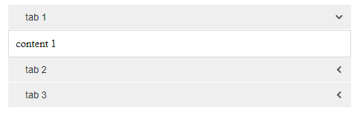

#Roll Navigation
-------------

### Description

	allows to rolldown or rollup text blocks

### Agruments

- autoClose - where to append the button
- speed
- title - title of the button
- opened - text block be opened when page be loaded
- class - class for button

-------------

	it have two way for initialize:
	1) create div element with class "rollnav" and define attributes wich must begin from "data-" + option
	2) use javascript notation as you can see below - in testing now!

### Examples

```html
	<div class="rollnav" data-auto-close="true">
		<div data-title="tab 1" data-opened="true">content 1</div>
		<div data-title="tab 2">content 2</div>
		<div data-title="tab 3">content 3</div>
	</div>
```

### Result



-------------
Thank's for using.
Developed by Ustinov Maxim - [ewclide](http://vk.com/ewclide)